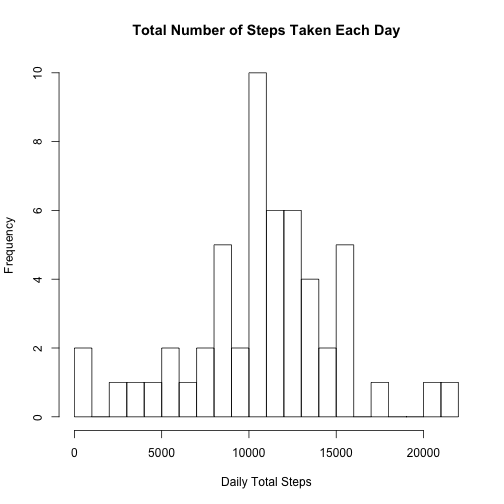
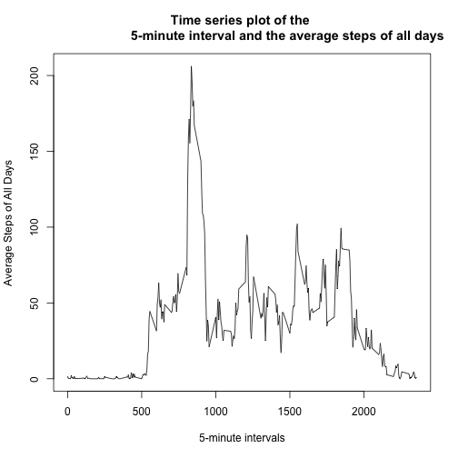
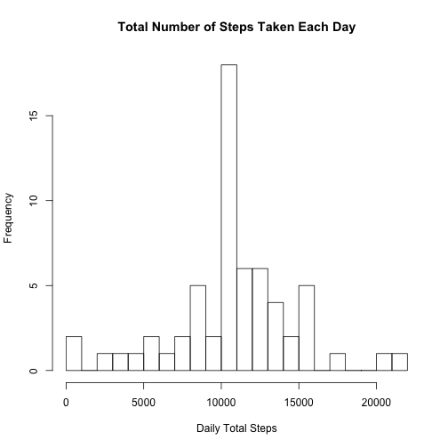
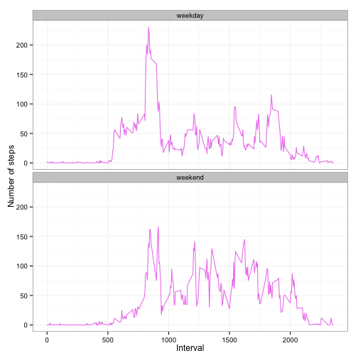

#Introduction  
It is now possible to collect a large amount of data about personal movement using activity monitoring devices such as a Fitbit, Nike Fuelband, or Jawbone Up. These type of devices are part of the “quantified self” movement – a group of enthusiasts who take measurements about themselves regularly to improve their health, to find patterns in their behavior, or because they are tech geeks. But these data remain under-utilized both because the raw data are hard to obtain and there is a lack of statistical methods and software for processing and interpreting the data.  

This assignment makes use of data from a personal activity monitoring device. This device collects data at 5 minute intervals through out the day. The data consists of two months of data from an anonymous individual collected during the months of October and November, 2012 and include the number of steps taken in 5 minute intervals each day.  

#Data  
The data for this assignment can be downloaded from the course web site:

- Dataset: Activity monitoring data [52K] (https://d396qusza40orc.cloudfront.net/repdata%2Fdata%2Factivity.zip)  

The variables included in this dataset are:

- steps: Number of steps taking in a 5-minute interval (missing values are coded as NA)

- date: The date on which the measurement was taken in YYYY-MM-DD format

- interval: Identifier for the 5-minute interval in which measurement was taken

The dataset is stored in a comma-separated-value (CSV) file and there are a total of 17,568 observations in this dataset.

#Assignment 

Set to show R code.

```r
library(knitr)
opts_chunk$set(echo=TRUE)
```
load all the libraries  

```r
library(dplyr)
library(ggplot2)
```
##Load and Process data
Read the data to the data frame.

```r
download.file("https://d396qusza40orc.cloudfront.net/repdata%2Fdata%2Factivity.zip", destfile="activity.zip", method="curl")
unzip("activity.zip")
activity<-read.csv("activity.csv")
```
Calculate total rows that contain na.

```r
total_missing<-sum(is.na(activity))
```
Seperate the dataset to two datasets, one contains the rows with NAs(act_NA), another one has no NAs(activity).  
extract the rows with NAs, and remove the steps column.

```r
act_NA<-filter(activity,is.na(steps))
act_NA<-select(act_NA,2,3)
activity <- na.omit(activity)
```
activity now contains no NA.
Total number of missing values in the dataset is 2304.  

##What is mean total number of steps taken per day?  

- Calculate total number of steps taken per day, and make a histogram of the total number of steps taken each day.

```r
daily_sum<-activity %>% group_by(date) %>% summarize(total_steps=sum(steps))
hist(daily_sum$total_steps, breaks=19, main="Total Number of Steps Taken Each Day", xlab="Daily Total Steps")
```

 

```r
mean_steps<-mean(daily_sum$total_steps)
median_steps<-median(daily_sum$total_steps)
```
- Mean of the total number of steps taken per day is 1.0766189 &times; 10<sup>4</sup>. Median of the total number of steps taken per day is 10765.  

##What is the average daily activity pattern?  

- Make a time series plot (i.e. type = "l") of the 5-minute interval (x-axis) and the average number of steps taken, averaged across all days (y-axis)

```r
mean_interval<-activity %>% group_by(interval) %>% summarize(mean_steps=mean(steps))
with(mean_interval, plot(interval,mean_steps, type = "l", main="Time series plot of the 
                         5-minute interval and the average steps of all days", 
                         ylab="Average Steps of All Days", xlab="5-minute intervals"))
```

 

```r
most_active<-mean_interval[mean_interval$mean_steps==max(mean_interval$mean_steps),][1]
```
- The 835th 5-minute interval, on average across all the days in the dataset, contains the maximum number of steps.     

##Imputing missing values  

- Total number of missing values in the dataset is 2304.   

Use the mean for that 5-minute interval to fill in all of the missing values in the dataset. Merge act_NA(dataset with NAs) with the mean_interval table. Now the steps are replaced withthe mean for that 5-minute interval.

```r
act_NA<-merge(act_NA,mean_interval, by="interval")
```
Reorder the new dataset to the same order as the activity DF. Rename the column to steps.

```r
act_NA<-arrange(act_NA, date, interval,mean_steps)
colnames(act_NA)[3] <- "steps"
```
- Create a new dataset that is equal to the original dataset but with the missing data filled in by combining the new DF with activity.

```r
data<-rbind(act_NA, activity)
data<-arrange(data, date, interval,steps)
```
- Make a histogram of the total number of steps taken each day and Calculate and report the mean and median total number of steps taken per day.

```r
new_daily_sum<-data %>% group_by(date) %>% summarize(total_steps=sum(steps))
hist(new_daily_sum$total_steps, breaks=19, main="Total Number of Steps Taken Each Day", xlab="Daily Total Steps")
```

 

```r
new_mean_steps<-mean(new_daily_sum$total_steps)
new_median_steps<-median(new_daily_sum$total_steps)
```
- After the NAs have been replaced by the mean for that 5-minute interval, the  mean of the total number of steps taken per day is 1.0766189 &times; 10<sup>4</sup>.  The median of the total number of steps taken per day is 1.0766189 &times; 10<sup>4</sup>.  

- The mean is the same as the estimate from the first part of the assignment. The median has been shifted a little to the right. After imput the missing data with the mean of that five-minute interval the peak number of the daily steps is bigger.  

##Are there differences in activity patterns between weekdays and weekends?  

- Create a new factor variable in the dataset that has NAs been filled with two levels – “weekday” and “weekend” indicating whether a given date is a weekday or weekend day.

```r
data$date<-as.Date(data$date)
data$Day_in_week<-ifelse((weekdays(data$date) %in% c("Monday","Tuesday","Wednesday","Thursday","Friday")), 
                         "weekday","weekend")
```
- Make a panel plot containing a time series plot (i.e. type = "l") of the 5-minute interval (x-axis) and the average number of steps taken, averaged across all weekday days or weekend days (y-axis).

```r
data_by_interval<-group_by(data,Day_in_week,interval)
mean_data_interval<-data %>% group_by(Day_in_week,interval) %>% summarize(mean_steps=mean(steps))
ggplot(mean_data_interval, aes(x=interval, y=mean_steps)) + 
  geom_line(color="violet") + 
  facet_wrap(~ Day_in_week, nrow=2, ncol=1) +
  labs(x="Interval", y="Number of steps") +
  theme_bw()
```

 
